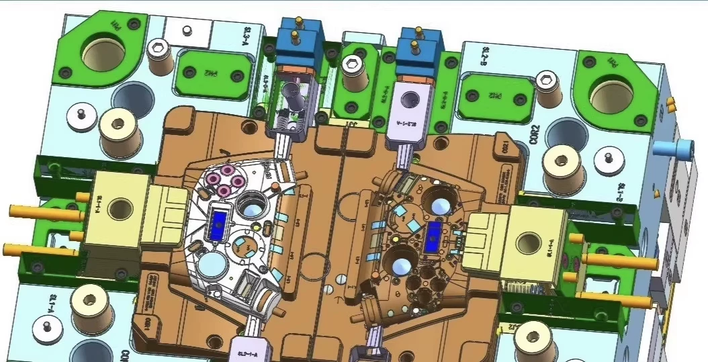
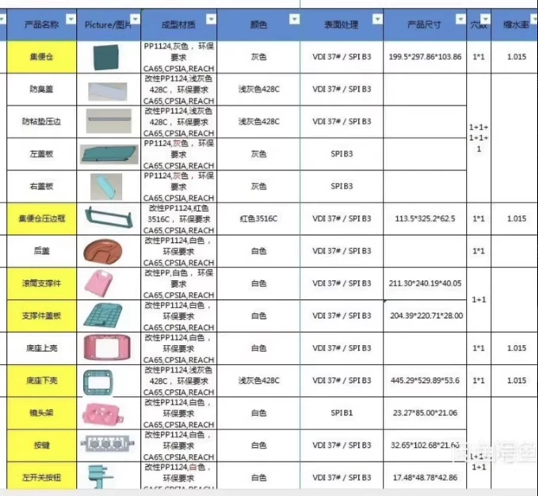
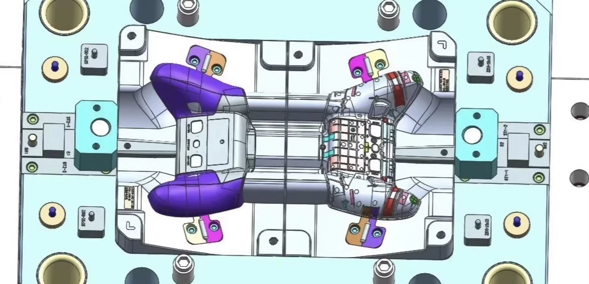
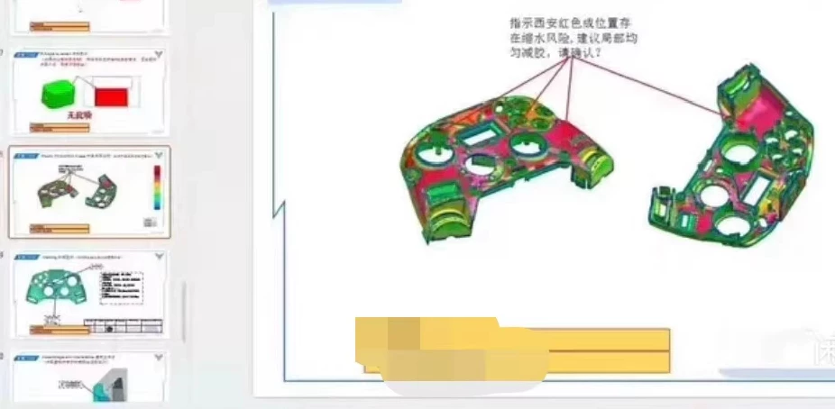
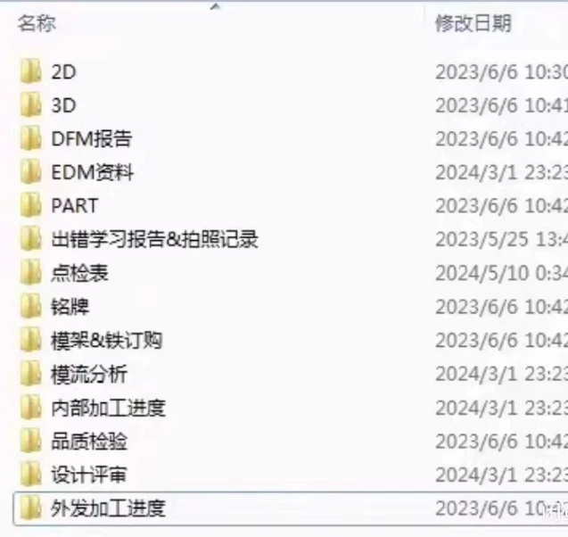

# I have shared over 100 sets of 3D drawings for molds produced by a large company in 2022, and they will be automatically shipped upon purchase.

## Body

Share the 2022 annual 100+ molds 3D drawing files from a major factory, automatically shipped upon purchase.

Share over 100 sets of molds with 3D drawing files for the entire year 2022 from a large company, which can be automatically dispatched upon purchase. The purchased items include comprehensively organized mold drawings from a major enterprise for the entire year 2022, all of which have been tested in mass production. The main types include keycap molds, light guide rods, support surface covers, bottom shells, gears, buttons, and battery covers, among others. For small and medium-sized molds, each set comes complete with complete molding data including: 2D part drawings, 2D assembly drawings, 3D assembly drawings, DFM molding report, mold flow analysis report, mold frame 2D and 3D drawings, hot runner drawings, quote, and mold material specifications. Additionally, there is a total mold list for all molds opened throughout the year.
For beginners, this provides a reliable reference to understand the structure of the molds, enhancing their capabilities and familiarity with the entire molding process.
The drawing files are approximately 100g in size, which can be opened by UG 10.0 or above versions.
The variety of mold structures is quite extensive due to the high number of mold sets, so I won't send out individual sets one by one.

## Images

## Payment

Here is a pay link on Stripe ( https://buy.stripe.com/3cs8yP7sY87d0vu9AB ). Please contact me lonlonago@foxmail.com after funding $89, and I will send you a complete data files , thank you!

